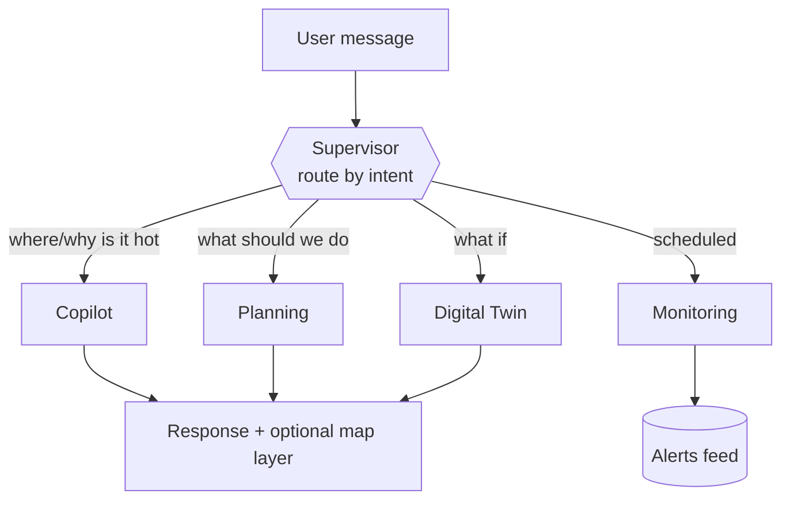

# Agents

Roles, tools, guardrails and prompt design for the LangGraph layer.

**Status:** design (Phase 4). Prompts and tool signatures are drafts — updated as built.

---

## 1. Design principles

**The LLM decides *what*, never computes *what*.** Every number a user sees comes from the
model, the scenario engine or a dataset — never from the LLM's own estimate. The LLM parses
intent, picks tools, and narrates results. If an agent ever states a temperature or a cost
that did not come from a tool call, that is a bug of the most serious kind.

**Tools are a typed allowlist.** The LLM chooses arguments; Pydantic validates them; the
function executes. No arbitrary code, no SQL generation, no shell.

**Budget-aware by construction.** ~10 requests/min on the Gemini free tier (ADR-0002) means
LLM hops per user request are capped, answers are cached, and 429s trigger backoff then a
Groq fallback.

**Fail loudly, never plausibly.** A tool that errors must produce "I couldn't compute that",
not an LLM-invented number. Plausible fabrication is the worst failure mode this system has.

---

## 2. Supervisor graph

Routing is a single classification call, not a negotiation between agents — chattier
multi-agent patterns burn the rate limit for no gain at this scale.

---

## 3. Shared toolbelt

Thin wrappers over Phase 3 services. Same functions the REST API exposes — one
implementation, two interfaces.

| Tool | Signature | Returns |
|---|---|---|
| `get_hotspots` | `(n: int = 10, by: "hvi" \| "lst" = "hvi")` | Ranked wards/cells with values |
| `get_cell_stats` | `(cell_id: int)` | Feature vector + LST + ward |
| `explain_cell` | `(cell_id: int)` | SHAP attribution, °C per driver |
| `explain_ward` | `(ward: str)` | Aggregated SHAP + summary stats |
| `simulate_scenario` | `(ward: str \| cell_ids: list, intervention: str, coverage: float)` | ΔLST per cell, summary, clamp warnings |
| `estimate_cost` | `(intervention: str, area_m2: float)` | Cost range + citation |
| `get_weather` | `(days: int = 7)` | Open-Meteo forecast |
| `get_trend` | `(ward: str \| None)` | LST trend °C/yr |
| `search_knowledge` | `(query: str, k: int = 4)` | Policy-document passages + sources |

Every tool returning a number also returns its **provenance** (dataset, model version, or
document + page) so the agent can cite rather than assert.

---

## 4. Agent 1 — Urban AI Copilot (RAG + data)

**Role** Answer planner questions over city data and policy documents.
**Tools** All read tools + `search_knowledge`.

**RAG corpus** (`data/knowledge_base/`) — Mumbai Climate Action Plan · NDMA heat-wave
guidelines · WHO heat-health fact sheets · IPCC AR6 urban excerpts · selected UHI papers.
All public documents; sources listed in `references.md`.

**Retrieval** ChromaDB embedded · `sentence-transformers/all-MiniLM-L6-v2` on CPU
(never a paid embedding API) · ~800-token chunks, 100 overlap · top-k 4.

**Guardrails**
- Answers about *the city* come from tools. Answers about *policy* come from retrieval with
  citations. Never blend the two silently.
- Retrieval miss → say so. Do not fall back to the model's own knowledge of Mumbai.
- Always distinguish measured (LST), modelled (predicted, simulated) and cited (documents).

*Draft system prompt*
> You are an urban-heat analyst for Greater Mumbai. Answer only from tool results and
> retrieved passages. Never estimate a temperature, cost or ranking yourself — call a tool.
> All temperatures are **surface** temperatures from satellite thermal imagery at ~10:30
> local time, not air temperature; say so when it matters. Cite the dataset or document
> behind every number. If tools and retrieval cannot answer, say you don't know.

## 5. Agent 2 — Planning Decision Agent

**Role** Turn hotspots into ranked, costed intervention plans.
**Tools** `get_hotspots`, `explain_ward`, `simulate_scenario`, `estimate_cost`.

**Method** Rank by HVI → read SHAP to find *why* each ward is hot → choose interventions
that target the actual driver (low NDVI → planting; high albedo deficit → cool roofs) →
simulate → cost → rank by ΔLST per rupee × population affected.

**Coefficients** `backend/agents/data/interventions.yaml` — a curated table of
literature-derived cost and effect ranges, each with a citation. The LLM reads this table;
it never invents a coefficient.

**Guardrails** Every recommendation carries ΔLST (modelled), cost range (literature), the
SHAP driver that motivated it, and the correlational caveat from `ml-methodology.md` §6.
Costs are order-of-magnitude, not quotes — and must be labelled that way.

## 6. Agent 3 — Digital Twin Simulation Agent

**Role** Natural language → structured scenario → engine → narration.
**Tools** `simulate_scenario`, `get_cell_stats`, `explain_ward`.

**Flow** "What if we plant trees across 20% of Kurla?" → `{ward: "Kurla", intervention:
"tree_planting", coverage: 0.2}` → engine → "≈1.8 °C mean surface cooling across 340 cells;
strongest where NDVI is currently lowest."

**Guardrails**
- Ambiguous input → ask, don't guess. An unstated coverage fraction is not 100%.
- Clamped scenarios (§6, `ml-methodology.md`) must **say** they were clamped.
- Phrase results as analogy, never causation: "cells like this but greener run ~1.8 °C
  cooler" — not "this will cool Kurla by 1.8 °C".

## 7. Agent 4 — Autonomous Monitoring Agent

**Role** Daily heatwave watch → alerts feed.
**Trigger** GitHub Actions cron (ADR-0003 — no Redis queue), ~06:00 IST.
**Tools** `get_weather`, `get_hotspots`, `explain_ward`.

**Logic — thresholds are rule-based, not LLM-judged.** IMD-style criteria (plains: max
≥40 °C, or ≥4.5 °C above normal) evaluated in code. The LLM only *drafts the wording* of
an alert whose trigger has already fired deterministically. An LLM deciding whether a
heatwave exists would be both unreliable and indefensible.

**Output** Alert row: severity, wards affected (forecast ∩ high HVI), drafted summary,
timestamp. Written to file (Phase 4) → Supabase (Phase 6). Optional email via Gmail SMTP.

**Guardrails** Dedupe — one alert per event, not per run. Cap emails per day. Alerts state
that they are model-derived and advisory, not an official IMD warning. This system is not
an authority and must never imply it is.

---

## 8. Rate-limit strategy

| Layer | Approach |
|---|---|
| Cap hops | Supervisor routes once; agents get a bounded tool-call loop (max ~4) |
| Cache | Hash (question + data version) → response; identical demo questions cost nothing |
| Backoff | Exponential retry on 429 (2s, 4s, 8s) |
| Fallback | `GROQ_API_KEY` set → retry there on repeated 429 |
| Warm demos | Pre-run the scripted demo questions so answers are cached |

**Not a defence — a warning.** A live viva demo hitting a rate limit looks like a crash. The
cache-warming step before any demo is a runbook item, not an optimisation.

---

## 9. Safety & privacy

- **No PII to the LLM, ever** (ADR-0002 — free-tier prompts may be used for product
  improvement). Inputs are public geospatial data and public documents only.
- User chat text is untrusted; it reaches tools only as Pydantic-validated arguments.
- Prompt injection surface: retrieved documents. Chunks are data, not instructions — the
  system prompt states that retrieved text is never to be followed as a command.
- Outputs are advisory. The dashboard footer says the system is a decision-support
  prototype, not an official heat advisory.
