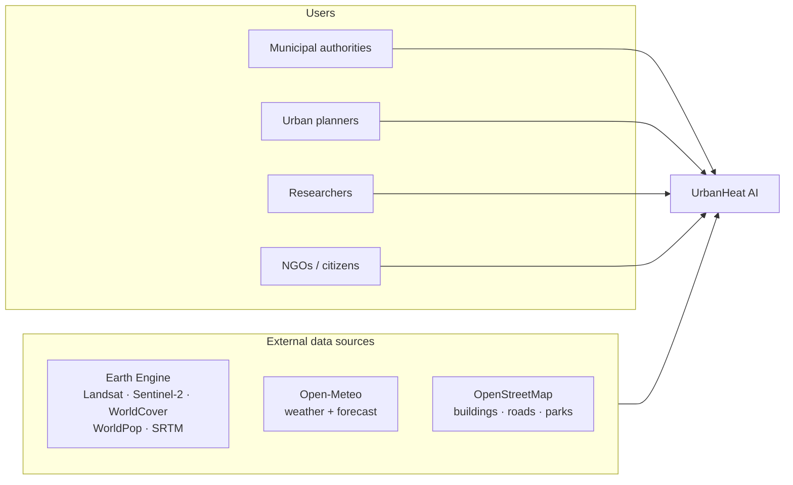
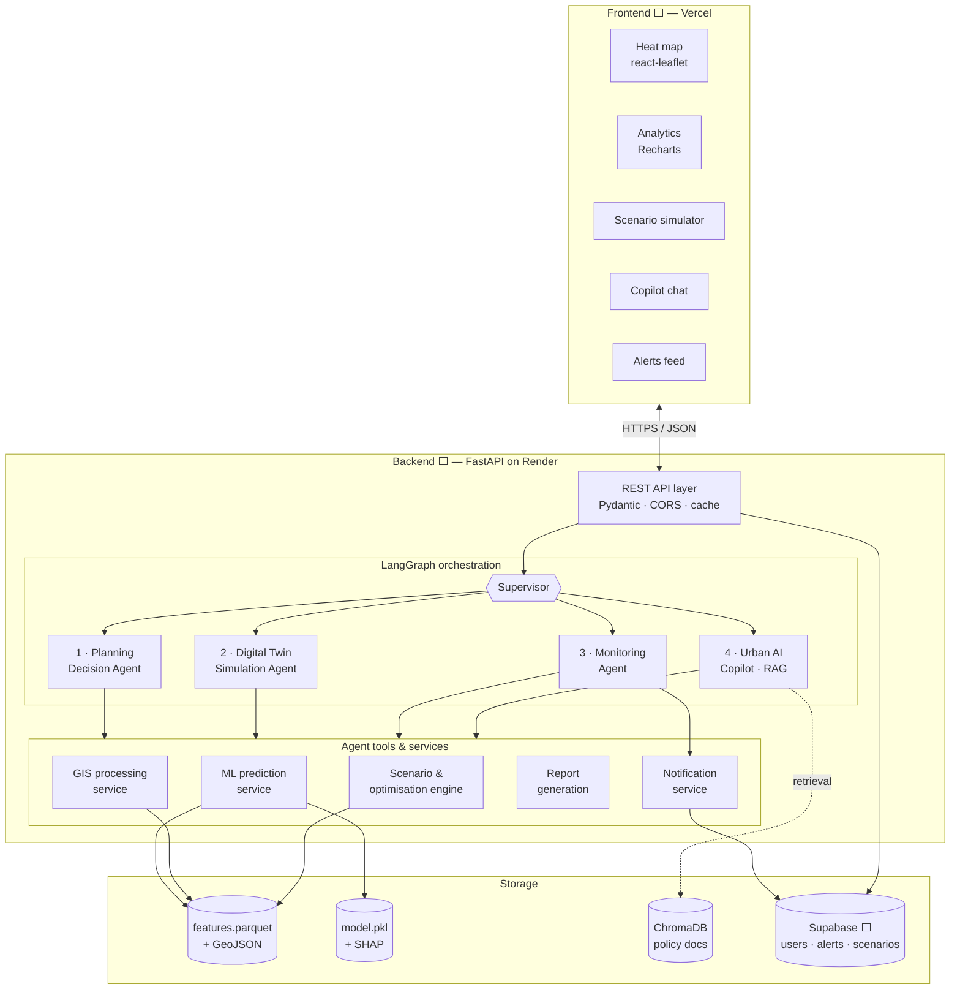
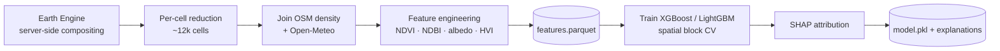
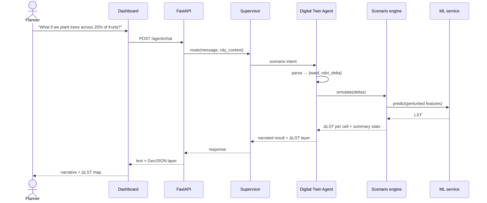
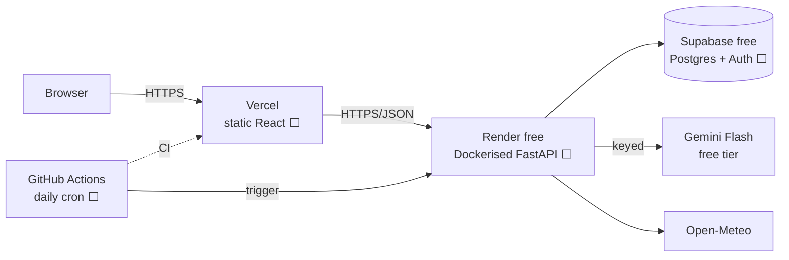

# Architecture

Text-based, editable re-creation of the system design. Diagrams are Mermaid so they stay
diffable and render on GitHub.

**Status:** target design. Components are marked ⬜ planned / 🟨 in progress / ✅ built,
and updated as phases land. As of Phase 0, no component in §2 or §6 is built — the only
thing proven to work is the Earth Engine access path at the head of §3.

---

## 1. Context

## 2. Components

**Why a supervisor.** The four agents share one toolbelt and one city state; routing in a
supervisor graph keeps that state in one place and makes each agent independently
testable. It also caps LLM calls per request, which matters on a 10 req/min free tier.

## 3. Offline pipeline

Runs on the developer's machine, not in the request path. Output is a set of data artifacts
the API reads, written to `data/processed/` and `models/`. They are **not** committed —
they are gitignored build outputs that must be regenerable by re-running the pipeline, and
that contract is what makes excluding them safe (ADR-0004).

**Key constraint.** All raster math happens inside Earth Engine and only the reduced
~12k-row table is downloaded. Pulling rasters to the laptop would blow both the RAM budget
and the Earth Engine compute quota.

**Proven in Phase 0.** The first box — server-side compositing of a cloud-masked,
dry-season Landsat LST stack over Mumbai — runs end to end and returns physically plausible
values (`notebooks/00_hello_earth_engine.ipynb`). Nothing was downloaded but three summary
numbers, which is the constraint above working as designed. The per-cell reduction and
everything right of it remain ⬜.

## 4. Request flow — a scenario query

## 5. Data flow legend

| Line | Meaning |
|---|---|
| `-->` | Request / response, in the hot path |
| `-.->` | Retrieval or background lookup |
| Pipeline (§3) | Offline, scheduled or manual — never blocks a user request |

## 6. Deployment

**Free-tier realities baked into the design**

- Render free **sleeps after 15 min idle**, ~1 min cold start → wake before demos; nothing
  user-facing may depend on sub-second first response.
- Render free gives **5 GB/mo bandwidth** → grid GeoJSON is simplified and gzipped, and
  the heavy tiles come from public OSM/CARTO basemaps, not from us.
- Gemini free tier is **Flash-only, ~10 req/min** → agent responses are cached, retried
  with backoff, and fall back to Groq.
- Earth Engine compute is quota'd monthly → pipeline runs are deliberate, not on a loop.
- No Redis, no WebSockets (ADR-0003) → in-process cache; alerts are polled, written by a
  GitHub Actions cron rather than a live queue.

## 7. Trust boundaries

- The **browser never holds an API key.** Gemini, Supabase service and SMTP credentials
  live only in the backend environment.
- The frontend gets the Supabase **anon** key only, from Phase 6, with row-level security
  enforced server-side.
- Agent tools are a fixed allowlist of typed functions — the LLM chooses arguments, never
  arbitrary code or SQL.
- User text reaching an agent is untrusted input; tool arguments are validated by Pydantic
  before execution.

---

Component rationale: [decisions/](decisions/) · Data specifics:
[data-dictionary.md](data-dictionary.md) · Agent internals: [agents.md](agents.md)
